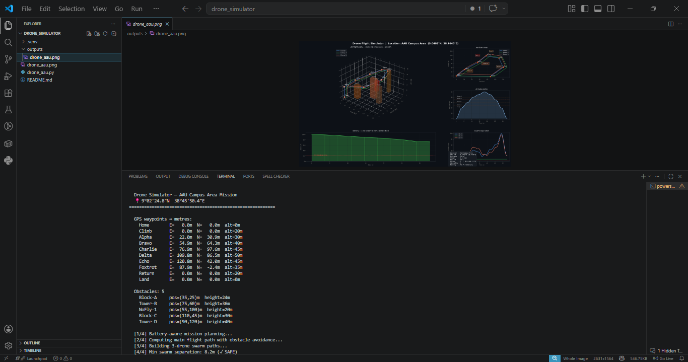

<div align="center">

# 🚁 Drone Flight Path Simulator

### Advanced UAV Mission Planning & 3D Visualization System
#### Built for INSA Aerospace Summer Camp Application 2026


---

*A physics-based drone flight simulator that accepts real GPS coordinates,
plans multi-waypoint UAV missions with 3D obstacle avoidance, battery-aware
Return-To-Home, and multi-drone swarm coordination — visualized in a
professional 6-panel matplotlib figure.*

[🎯 Mission Details](#-specific-mission) · [🚀 Quick Start](#-quick-start) ·
[🔬 How It Works](#-how-it-works) · [📐 Engineering Concepts](#-engineering-concepts) ·
[📚 Resources](#-resources)

</div>

---

## 📌 What This Project Does

This simulator models the complete flight planning pipeline of a real UAV
(Unmanned Aerial Vehicle) system. It goes beyond simple path drawing —
it incorporates the same engineering principles used in professional
autopilot systems like ArduPilot and PX4.

### Core Capabilities

| Capability | Description | Real-World Equivalent |
|---|---|---|
| GPS waypoint input | Accepts real lat/lon coordinates | MAVLink MISSION_ITEM |
| Obstacle avoidance | 3D box obstacles, automatic rerouting | ArduPilot object avoidance |
| Battery RTH | Auto return-to-home at threshold % | DJI Return-To-Home |
| Swarm coordination | 3 drones, collision monitoring | SwarmLink / Hivemapper |
| Wind physics | Sinusoidal gust modelling | Flight controller IMU filtering |
| Smoothstep trajectory | Cubic ease-in/out between waypoints | Bezier path planning |
| 6-panel visualization | Full mission analytics dashboard | Mission Planner GCS |

---

## 🎯 Specific Mission

### Mission: AAU Campus Area Reconnaissance
**Reference location:** `9°02'24.8"N  38°45'50.4"E` — Addis Ababa, Ethiopia

This mission simulates a **reconnaissance and survey flight** over a
campus-scale urban area. The objective is to navigate a defined route,
collect survey data at each waypoint, avoid tall structures, and return
safely — all while coordinating a 3-drone swarm and managing battery reserves.

### Mission Parameters

| Parameter | Value |
|---|---|
| Reference GPS | 9.040222°N, 38.764000°E |
| Mission type | Area reconnaissance / survey |
| Total distance | 393 metres |
| Flight time | ~0.55 minutes (33 seconds at cruise) |
| Max altitude | 50 metres AGL (Above Ground Level) |
| Cruise speed | 12 m/s |
| Climb rate | 4 m/s |
| Descent rate | 3 m/s |
| Wind | 1.0 m/s @ 60° (NE) |
| Battery capacity | 100% — 72.4% remaining at landing |
| RTH threshold | 20% battery |
| Drones in swarm | 3 |
| Min swarm separation | 8.2 m ✓ (threshold: 5.0 m) |
| Obstacles avoided | 5 structures |

### Waypoint Route

```
WP0  Home      →  GPS: 9.040222, 38.764000  |  Alt:  0m  (take-off point)
WP1  Climb     →  GPS: 9.040222, 38.764000  |  Alt: 20m  (vertical climb)
WP2  Alpha     →  GPS: 9.040500, 38.764200  |  Alt: 30m  (fly north-east)
WP3  Bravo     →  GPS: 9.040800, 38.764500  |  Alt: 40m  (continue NE)
WP4  Charlie   →  GPS: 9.041100, 38.764700  |  Alt: 45m  (survey point 1)
WP5  Delta     →  GPS: 9.041000, 38.765000  |  Alt: 50m  (peak — survey point 2)
WP6  Echo      →  GPS: 9.040600, 38.765100  |  Alt: 45m  (turn south)
WP7  Foxtrot   →  GPS: 9.040200, 38.764800  |  Alt: 35m  (approach corridor)
WP8  Return    →  GPS: 9.040222, 38.764000  |  Alt: 20m  (final approach)
WP9  Land      →  GPS: 9.040222, 38.764000  |  Alt:  0m  (touchdown)
```

### Obstacles in Mission Area

```
Block-A    →  Position: E=35m, N=25m  |  Height: 24m  (mid-rise building)
Tower-B    →  Position: E=75m, N=60m  |  Height: 36m  (tall structure — rerouted over)
NoFly-1    →  Position: E=55m, N=100m |  Height: 20m  (restricted zone)
Block-C    →  Position: E=110m, N=45m |  Height: 30m  (building)
Tower-D    →  Position: E=90m, N=120m |  Height: 40m  (tallest — rerouted over)
```

When the planned path intersects any obstacle, the simulator automatically
inserts a detour waypoint 10m above the obstacle top, reroutes through it,
then continues to the original destination.

### Swarm Formation

The 3-drone swarm flies in a **triangular formation** with fixed spatial offsets:

```
Drone 1 (blue)  →  Formation lead   — offset (0m,  0m)
Drone 2 (green) →  Right wingman    — offset (10m, 0m)
Drone 3 (orange)→  Rear centre      — offset (5m, 10m)
```

Minimum separation maintained throughout the mission: **8.2 metres** —
safely above the 5m collision-avoidance threshold.

---

## 📊 Visualization Output

The simulator produces a **6-panel figure** (`drone_aau.png`):



```
┌─────────────────────────┬──────────────┐
│                         │  Top-down    │
│   3D Flight Path        │  map view    │
│   (swarm + obstacles)   │              │
│                         ├──────────────┤
│                         │  Altitude    │
│                         │  profile     │
├─────────────────────────┼──────────────┤
│  Battery level chart    │  Swarm       │
│  with RTH threshold     │  separation  │
└─────────────────────────┴──────────────┘
```

| Panel | What it shows |
|---|---|
| 3D flight path | All 3 drones navigating obstacles in 3D space |
| Top-down map | Bird's eye view with obstacle footprints |
| Altitude profile | Height over time with obstacle height markers |
| Battery chart | Drain curve with green/yellow/red zones + RTH line |
| Swarm separation | Distance between each drone pair over time |
| Stats box | All key mission metrics in one place |

---

## 🚀 Quick Start

### Prerequisites

```bash
pip install matplotlib numpy
```

No other dependencies — runs entirely on Python standard libraries
plus matplotlib and numpy.

### Run the AAU Mission

```bash
# Clone the repository
git clone https://github.com/YOURUSERNAME/drone-simulator.git
cd drone-simulator

# Run the simulation
python drone_aau.py

# Output saved automatically as drone_aau.png
```

### Run with Your Own GPS Coordinates

```python
# Edit GPS_POINTS in drone_aau.py with coordinates from Google Maps
# Right-click any location in Google Maps → copy lat/lon

GPS_POINTS = [
    (9.040222, 38.764000),   # Home — your take-off point
    (9.040500, 38.764200),   # Waypoint Alpha
    (9.040800, 38.764500),   # Waypoint Bravo
    (9.040222, 38.764000),   # Return home
]
ALTITUDES = [0, 30, 40, 0]
LABELS    = ["Home", "Alpha", "Bravo", "Land"]
```

**Tip:** Every `0.0001°` offset ≈ **11 metres**. Use this to place
waypoints at realistic distances from your reference point.

### Add Custom Obstacles

```python
# Obstacle(cx, cy, cz, half_x, half_y, half_z, label, color)
# cx/cy = centre in metres from Home | half_z = half-height
obstacles = [
    Obstacle(50,  30, 0, 10, 10, 15, "University Hall", "#8B4513"),
    Obstacle(90,  70, 0,  5,  5, 25, "Communications Tower", "#A0522D"),
    Obstacle(30, 100, 0,  8,  8,  8, "No-Fly Zone", "#8B0000"),
]
```

### Tune the Drone Physics

```python
config = DroneConfig()
config.MAX_SPEED        = 15.0   # m/s — faster drone
config.CLIMB_RATE       =  6.0   # m/s — aggressive climb
config.DESCENT_RATE     =  3.0   # m/s
config.LOW_BATTERY      = 25.0   # % — earlier RTH trigger
config.WIND_STRENGTH    =  2.5   # m/s — stronger wind
config.WIND_DIRECTION   = 90.0   # degrees compass (90=East)
config.SAFE_DISTANCE    =  8.0   # m — stricter swarm spacing
```

---

## 🔬 How It Works

### 1. GPS Coordinate Conversion

Real GPS coordinates are converted to local X/Y metres using the
**Equirectangular projection** — the standard method used in UAV
ground control software for areas smaller than ~10km:

```python
def gps_to_metres(lat, lon, ref_lat, ref_lon):
    R = 6_371_000   # Earth radius in metres
    x = R * radians(lon - ref_lon) * cos(radians(ref_lat))
    y = R * radians(lat - ref_lat)
    return x, y
```

The first waypoint becomes the coordinate origin (0, 0). All subsequent
waypoints are expressed as metres East (X) and North (Y) from that origin.

### 2. Obstacle Avoidance

The path between each waypoint pair is sampled at 30 evenly-spaced points.
If any sample point falls inside an obstacle's bounding box (plus a 3m
safety margin), a **detour midpoint** is inserted 10m above the obstacle top:

```
Straight path hits obstacle
         ↓
Midpoint = ((x1+x2)/2, (y1+y2)/2, obstacle_top + 10m)
         ↓
Path rerouted: WP_A → Midpoint → WP_B
```

This is a simplified implementation of the **potential field method**
used in real UAV autopilots.

### 3. Battery-Aware RTH

Before flying each segment, the planner estimates:
- Energy cost of the segment ahead
- Energy needed to fly from the next waypoint back to Home
- Adds LOW_BATTERY (20%) as a mandatory reserve

If `battery - segment_cost < home_reserve + 20%`, the mission is
interrupted and a Return-To-Home sequence is inserted before
battery reaches critical level.

### 4. Smoothstep Trajectory

Instead of straight-line segments (which would require infinite
acceleration at waypoints), the simulator uses **cubic smoothstep**
interpolation for smooth velocity transitions:

```python
t_smooth = t² × (3 - 2t)   # smoothstep formula
```

This produces the same S-curve velocity profile used in professional
flight controllers (ArduPilot SPLINE waypoints).

### 5. Swarm Coordination

Each drone flies the same waypoint sequence but with a fixed spatial offset
applied to all X/Y positions. Separation is monitored at every interpolation
step by computing pairwise Euclidean distances:

```python
separation = ||drone_i_position - drone_j_position||
```

If separation drops below SAFE_DISTANCE at any point, a warning is shown.

### 6. Wind Physics

Atmospheric turbulence is modelled as a sinusoidal drift applied to the
interpolated path:

```python
drift_x = wind_strength × sin(t) × cos(wind_angle) × 0.3
drift_y = wind_strength × sin(t + 1) × sin(wind_angle) × 0.3
```

Real drones compensate for this using IMU + GPS fusion in their flight
controllers — the simulator shows what the path looks like without
active correction, demonstrating why stabilisation is critical.

---

## 📐 Engineering Concepts Demonstrated

| Concept | Implementation | Real-World Application |
|---|---|---|
| Coordinate systems | GPS → local ENU (East-North-Up) | All UAV ground control software |
| Path planning | Waypoint interpolation + detour insertion | ArduPilot AUTO mode |
| Energy management | Battery drain model with reserve calculation | DJI Intelligent Flight Battery |
| Collision avoidance | Bounding box intersection + rerouting | ADS-B / TCAS in aviation |
| Formation flying | Fixed offset swarm with separation monitoring | Military UAV swarms |
| Trajectory smoothing | Cubic smoothstep (≈ Bezier curves) | PX4 trajectory generator |
| Atmospheric effects | Sinusoidal wind drift model | UAV wind compensation algorithms |
| Sensor fusion concept | GPS + altitude fused position | Flight controller EKF |

---

## 📁 Project Structure

```
drone-simulator/
├── drone_aau.py            ← Main simulator (AAU campus mission)
├── drone_simulator_v2.py   ← Generic simulator (any location)
├── drone_aau.png           ← Output visualization (auto-generated)
├── requirements_drone.txt  ← Dependencies (matplotlib, numpy)
└── README.md               ← This file
```

---

## 📚 Resources

### UAV & Autopilot Systems
- [ArduPilot Documentation](https://ardupilot.org/copter/) — the most widely used
  open-source autopilot, implements many of the concepts in this simulator
- [PX4 Autopilot](https://px4.io/) — professional open-source flight controller
- [Mission Planner](https://ardupilot.org/planner/) — real UAV ground control software,
  the professional version of what this simulator does
- [MAVLink Protocol](https://mavlink.io/en/) — the communication protocol real drones
  use to receive waypoint missions
- [QGroundControl](http://qgroundcontrol.com/) — another professional GCS (Ground Control Station)

### Aerospace Engineering
- [NASA UAV Research](https://www.nasa.gov/aeronautics/uam/) — NASA Urban Air Mobility program
- [FAA Drone Regulations](https://www.faa.gov/uas) — real-world airspace rules for UAVs
- [ICAO UAS Toolkit](https://www.icao.int/safety/UA/Pages/default.aspx) — international
  aviation standards for unmanned aircraft
- [Equirectangular Projection](https://en.wikipedia.org/wiki/Equirectangular_projection) —
  the map projection used for GPS → metre conversion in this simulator

### Swarm & Multi-Agent Systems
- [Crazyswarm](https://crazyswarm.readthedocs.io/) — real multi-drone swarm research platform
- [Boids Algorithm](https://www.red3d.com/cwr/boids/) — foundational paper on flocking behaviour
- [SwarmLink](https://www.dji.com/) — DJI's commercial swarm coordination system

### Python Scientific Computing
- [Matplotlib 3D Tutorials](https://matplotlib.org/stable/tutorials/toolkits/mplot3d.html)
- [NumPy for Scientists](https://numpy.org/doc/stable/user/quickstart.html)
- [SciPy Spatial](https://docs.scipy.org/doc/scipy/reference/spatial.html) — for
  advanced distance calculations and spatial indexing

### Datasets & Real UAV Data
- [OpenAIP](https://www.openaip.net/) — open aviation data including airspace boundaries
- [SRTM Elevation Data](https://www2.jpl.nasa.gov/srtm/) — NASA real terrain elevation
  data (can be integrated to make obstacles match real terrain)
- [OpenStreetMap](https://www.openstreetmap.org/) — real building footprint data
  (can replace hardcoded obstacle positions with actual building locations)

---

## 🔮 Future Enhancements

- [ ] Integrate SRTM real terrain elevation data
- [ ] Pull real building heights from OpenStreetMap
- [ ] Add dynamic obstacle detection (moving objects)
- [ ] Implement Dubins path planning for fixed-wing aircraft
- [ ] Add payload drop simulation (search and rescue)
- [ ] Export mission to MAVLink `.waypoints` format (loadable in Mission Planner)
- [ ] Real-time simulation with animation (matplotlib FuncAnimation)
- [ ] Add geofence boundary enforcement

---

## 👤 Author

**Yenesew**
📍 Addis Ababa, Ethiopia
🎯 Mission reference: `9°02'24.8"N  38°45'50.4"E`

---

<div align="center">

*"The desire to fly is an idea handed down to us by our ancestors
who looked enviously on the birds soaring freely through space." — Wilbur Wright*

</div>
